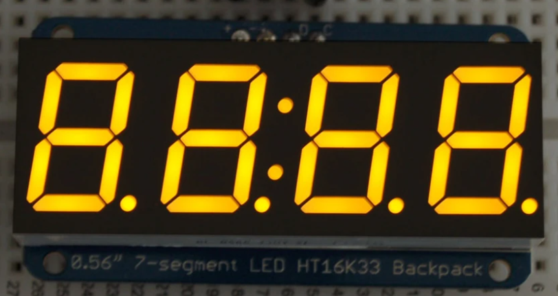
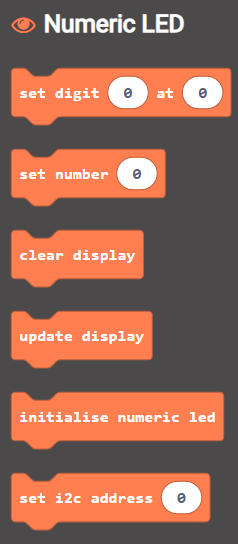

# Microbit Makecode Extension for the Adafruit 7-Segment Numeric Display
This block will work with the display with the [I2C interface](https://www.adafruit.com/product/879)

> Open this page at [https://lewfer.github.io/mb-numeric-led/](https://lewfer.github.io/mb-numeric-led/)

## Use as Extension

This repository can be added as an **extension** in MakeCode.

* open [https://makecode.microbit.org/](https://makecode.microbit.org/)
* click on **New Project**
* click on **Extensions** under the gearwheel menu
* search for **https://github.com/lewfer/mb-numeric-led** and import

## Edit this project 

To edit this repository in MakeCode.

* open [https://makecode.microbit.org/](https://makecode.microbit.org/)
* click on **Import** then click on **Import URL**
* paste **https://github.com/lewfer/mb-numeric-led** and click import

## Blocks preview

This image shows the blocks code from the last commit in master.
This image may take a few minutes to refresh.

## Notes
Currently does not support setting the decimal point or colon.